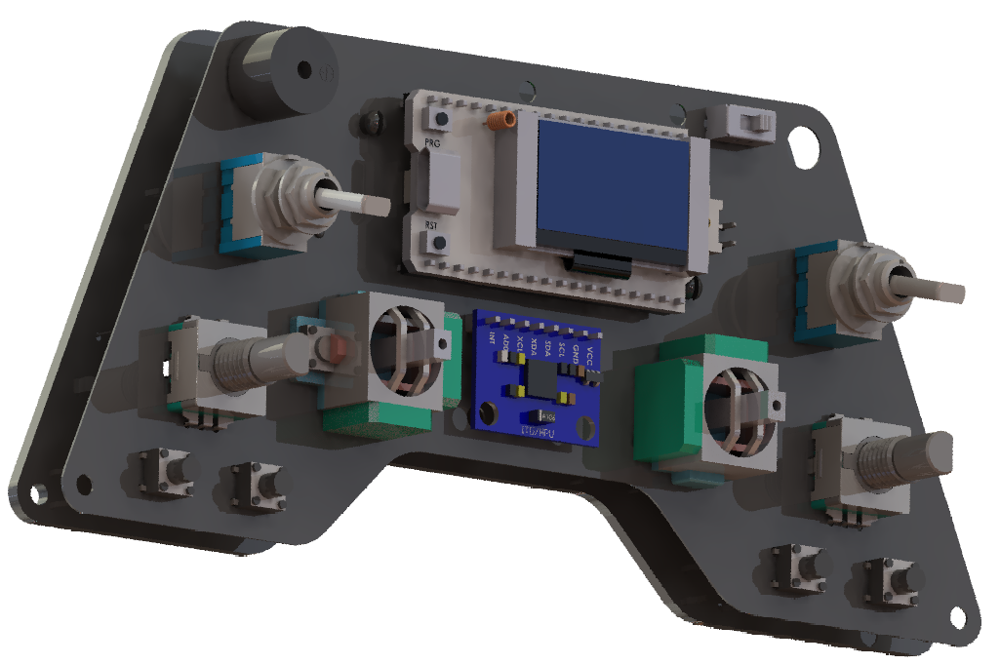

<h1> DIY Remote Control </h1>

 
    This is a general DIY remote control made with Heltec Lora32 V3 to coordinate other projects like a drone, a car and others.  

<h2>  🔗 Resume </h2>

<h2>  🛠️ Bill of Materials </h2>

- Heltec Lora32 V3
- 3.7V Lithium Battery or 1s Lipo Battery - 1un.
- JST-2.54-2P 90º - 2un.
- Joystick PS4 - 2un.
- Potentiometer - 2un.
- Toggle Switch - 2un.
- Push Button 6x6x7 - 4un.
- Passive Buzzer 12mm - 1un.
- Switch SS12D07L2B - 1un.
- MPU6050 - 1un.

<h2>  ✔️ Techniques and technologies </h2>

